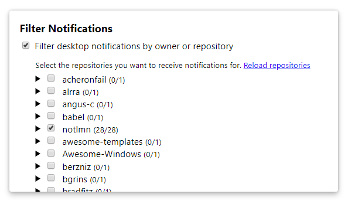

#  Notifier for GitHub 

[link-cws]: https://chrome.google.com/webstore/detail/notifier-for-github/lmjdlojahmbbcodnpecnjnmlddbkjhnn "Version published on Chrome Web Store"
[link-amo]: https://addons.mozilla.org/en-US/firefox/addon/notifier-for-github/ "Version published on Mozilla Add-ons"

> Browser extension - Get notified about new GitHub notifications

Checks for new GitHub notifications every minute, shows the number of notifications you have, and shows desktop notifications as well.

## Install

- [**Chrome** extension][link-cws] [][link-cws]
- [**Firefox** add-on][link-amo] [][link-amo]
- **Opera** extension: Use [this Opera extension](https://addons.opera.com/en/extensions/details/download-chrome-extension-9/) to install the Chrome version.

## Highlights

- [Notification count in the toolbar icon.](#notification-count)
- [Desktop notifications.](#desktop-notifications)
- [Filter notifications](#filtering-notifications) from repositories you wish to see.
- [GitHub Enterprise support.](#github-enterprise-support)
- Click the toolbar icon to go to the GitHub notifications page.
- Option to show only unread count for issues you're participating in.

*Make sure to add a token in the options.*

## Screenshots

### Notification Count

### Options

## Permissions

The extension requests a couple of optional permissions. It works as intended even if you disallow these. Some features work only when you grant these permissions as mentioned below.

### Tabs Permission

When you click on the extension icon, the GitHub notifications page is opened in a new tab. The `tabs` permission lets us switch to an existing notifications tab if you already have one opened instead of opening a new one each time you click it.

This permission also lets us update the notification count immediately after opening a notification. You can find both of these options under the "Tab handling" section in the extension's options page.

### Notifications Permission

If you want to receive desktop notifications for public repositories, you can enable them on extension options page. You will then be asked for the `notifications` permission.

### Repos Permission

If you want to receive (useful) desktop notifications for any private repositories you have, you will have to create a GitHub personal access token that has access to the `repo` scope as well. This is due to GitHub's current permission scheme, as the only way we can read anything about your private repos is if we have full control over repositories.

If you're concerned with your security in this manner, please feel free to ignore this scope. Just be aware that if you do not grant this scope, clicking on the notification will take you to the notifications home page, since we can't get any information about the repo you got the notification for.

## Configuration

### Desktop Notifications

You can opt-in to receive desktop notifications for new notifications on GitHub. The extension checks for new notifications every minute, and displays notifications that arrived after the last check if there are any. Clicking on the notification opens it on GitHub.

### Filtering Notifications

If you have [desktop notifications](#desktop-notifications) enabled as mentioned above, you can also filter which repositories you wish to receive these notifications from. You can do this by only selecting the repositories (that grouped by user/organization) in the options menu.

### GitHub Enterprise support

By default, the extension works for the public [GitHub](https://github.com) site. If you want the extension to show notifications from a GitHub Enterprise server, you have to configure the extension to use the API URL for your GitHub Enterprise server (like `https://github.yourco.com/`).

## Maintainers

- [Sindre Sorhus](https://github.com/sindresorhus)
- [Laxman Damera](https://github.com/notlmn)

###### Former

- [Yury Solovyov](https://github.com/YurySolovyov)
